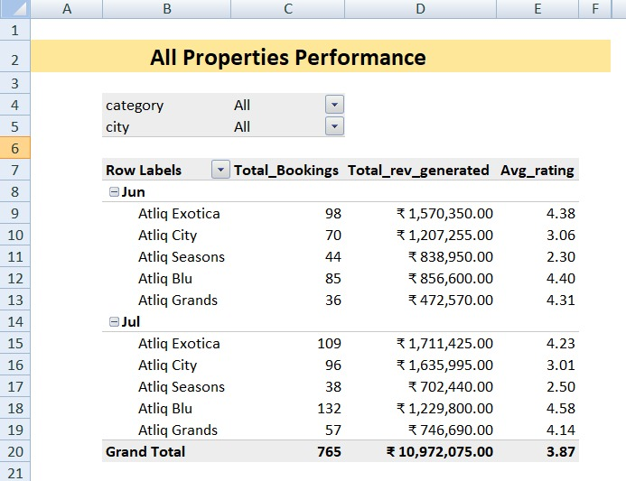

# end-to-end-hospitality-data-analysis-powerpivot-dax
Hospitality analytics project using PowerPivot &amp; DAX. Designed a data model, performed data transformation, and built reports to analyze revenue trends, booking platforms, and property performance.

🏨 Hospitality Analytics using PowerPivot & Power Query
📌 Project Overview

This project focuses on analyzing hotel booking data using PowerPivot, Power Query, and DAX to generate meaningful business insights. The goal was to recreate analytical reports based on a real-world challenge and answer key business questions.

The dataset includes booking details, property information, revenue, and customer ratings, enabling a complete performance analysis of hotel operations.

🎯 Objective
Build a data model using PowerPivot
Create DAX measures for analysis
Develop interactive reports using Pivot Tables
Answer key business questions related to:
Revenue performance
Booking platforms
Property-wise analysis
Customer ratings

As mentioned in the instructions, the project involved replicating reports using PowerPivot and DAX measures

📂 Dataset Description
1. fact_bookings

Contains transactional booking data:

Booking ID
Property ID
Booking platform
Revenue generated
Ratings
Booking status
Week & Month details
2. dim_properties

Contains property-level details:

Property name
Category
City
⚙️ Tools & Technologies
Microsoft Excel
Power Query
PowerPivot (Data Model)
DAX (Data Analysis Expressions)
🔗 Data Modeling
Imported CSV files using Power Query
Loaded data into Data Model
Created relationship:
property_id (fact_bookings) → property_id (dim_properties)

This enabled cross-table analysis and aggregation.

📊 Key DAX Measures

Some of the measures created:

Total Bookings = COUNT(fact_bookings[booking_id])

Total Revenue = SUM(fact_bookings[revenue_generated])

Average Rating = AVERAGE(fact_bookings[ratings_given])

These measures were used across all reports.

📈 Report 1: Property Performance Analysis

This report shows performance across properties for June and July.

🔍 Key Insights
Atliq Exotica generated the highest revenue overall
Atliq Blu had the highest rating in July (4.58)
Atliq Seasons consistently underperformed in rating
Total Revenue: ₹1,09,72,075
Average Rating: 3.87

📊 Report 2: Booking Platform Analysis

This report analyzes bookings and revenue by platform across weeks.

🔍 Key Insights
"Others" platform contributed the highest bookings and revenue
MakeYourTrip is a strong secondary contributor
Direct offline bookings are relatively low

👉 Example (Week 28):

Others: ₹15,27,725
MakeYourTrip: ₹8,88,175

📌 Key Learnings
Hands-on experience with PowerPivot Data Modeling
Writing and using DAX measures
Understanding fact & dimension tables
Creating business insights from raw data
Translating data into decision-making insights

🚀 Project Highlights

✔ Built complete data model
✔ Used real-world dataset
✔ Applied DAX for analytics
✔ Generated actionable business insights
